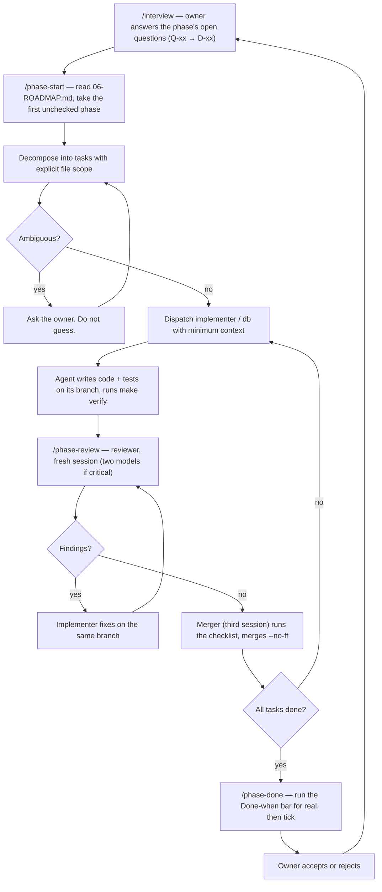

# 08 — AI Workflow

Savdo is built AI-native: the owner writes **zero production code**. Scope, answers,
approvals and acceptance are human. Every line of implementation comes from directed
agents. The process is a deliverable in itself, so it is written down here and measured.

## The fleet

| Role              | Model            | Does                                                                                                                                     | Never does                                                          |
| ----------------- | ---------------- | ---------------------------------------------------------------------------------------------------------------------------------------- | ------------------------------------------------------------------- |
| **Owner** (human) | —                | Sets scope, answers interview questions, approves architecture/dependencies/money, accepts or rejects a closed phase                     | Write code; run the loop by hand                                    |
| **Orchestrator**  | Fable 5.1        | **The interactive session.** Interviews the owner, reasons, decomposes, dispatches with minimum context, sequences, tracks the roadmap    | Write any file — code, tests, docs, decision rows, checkboxes. An orchestrator that edits has stopped orchestrating (D-27) |
| **Implementer**   | Sonnet 5         | Code + tests for exactly one scoped task                                                                                                 | Touch files outside its brief; tick boxes; merge                    |
| **db**            | Sonnet 5         | goose migrations, sqlc queries, seeds; knows the schema traps                                                                            | Edit a merged migration; UPDATE `stock_levels`                      |
| **Reviewer**      | Sonnet 5 / Opus 5 | Reviews a diff against docs, ADRs and the phase bar; findings only. Critical modules: Sonnet **and** Opus, fresh sessions, split scopes | Fix what it finds                                                   |
| **Merger**        | Sonnet 5         | Runs `make verify` and the merge checklist on a branch it did not write; merges `--no-ff`                                                | Merge its own diff; skip the gate                                   |
| **Scribe**        | Haiku 4.5        | Bulk reads, searches, web/version lookups, moves, formatting, changelogs, commit text                                                    | Make a design decision                                              |

Model choice is a cost decision, not a status one. The orchestrator's context is the
scarce resource: forty files of reading go to Haiku, not to Fable.

Definitions live in `.claude/agents/`. There is no orchestrator subagent.

## The loop

## Interviewing the owner

The owner asked to be interviewed rather than guessed at (D-17). Rules:

- Batch questions (up to four per round) with a recommended option first and the
  consequence of each option in one line. Plain English, B1/B2.
- Ask before a phase starts, for that phase's Q-xx entries only. Do not front-load every
  question for every phase.
- Write the answer to `00-DECISIONS.md` as a D-xx **before** dispatching work that
  depends on it. Cross-link to an ADR when it is technical.
- If the owner says "I don't know", record it as still open and design so the choice is
  deferred (adapter, config, feature flag) — see D-09/ADR-009 for the pattern.
- Never re-ask a decided question. Never treat silence as a decision.

## Context discipline

The biggest failure mode in agent-built software is an agent with too much context
making a confident change in the wrong place. The orchestrator's real job is **deciding
what each agent is not allowed to see**.

Every dispatched task carries exactly this:

1. **Goal** — one or two sentences of observable behaviour
2. **File scope** — paths it may create or modify; everything else is out of bounds
3. **Doc pointers** — sections, not paste (`04-DATA-MODEL.md § 3`, `05-API.md § Stock`)
4. **Acceptance check** — the test that must pass, or the behaviour to demonstrate
5. **Known traps** — from § Known failure modes below and `.claude/agents/db.md`
6. **Model and review tier** — ordinary or correctness-critical

An agent that needs context outside its brief **stops and asks**. That is a signal the
decomposition was wrong; the fix belongs in the task.

## Operating constraints (parallel agents)

1. **One writer per worktree.** Parallel implementers use `git worktree` under
   `.claude/worktrees/`; never two writers on one checkout.
2. **Merge early, in dependency order**: contract → migration → service → handler →
   client. Serialize migration-numbering conflicts.
3. **Cap review rounds on ordinary modules**: APPROVE with only MINOR → merge, follow-up
   task for polish. Critical modules need a clean two-model gate.
4. **The orchestrator owns the queue** and the merge order. The merger holds the primary
   checkout until its merges land.
5. **Contract changes serialize.** Only one branch edits `contracts/openapi.yaml` at a
   time; the orchestrator sequences them because every client depends on it.
6. **Shared local services.** One Compose project and one API port serve every worktree — see `07-DEVOPS.md` § Shared local services. Never take the stack down while another agent may be using it.
7. **One heavy gate at a time.** Testcontainers-based gates are sequenced by the orchestrator (O-13); a merger that sees timeouts under load retries once after the machine is quiet, never in parallel.
8. **One emulator session per agent.** Two implementers driving the same Android AVD (same package, same SecureStore and autofill state, queued `adb shell input` events) corrupt each other's smoke tests. Parallel mobile implementers each get their own AVD (`savdo36-<task>`) created by the orchestrator, their own API port and Metro port, and never kill processes they did not start (check the cwd of a PID before `kill`). On this 14 GB host only ONE emulator runs at a time (two x86_64 AVDs pushed the machine into swap and killed one); boot with `-memory 1536`, and implementers take turns in an orchestrator-managed queue, coding and static checks first, device smoke when the slot is free.

## Rules (non-negotiable, restated from `AGENTS.md`)

1. No agent merges its own work.
2. Reviewers report; they never fix.
3. The docs are the specification; fix the doc first when it is wrong.
4. Roadmap boxes are ticked only by `/phase-done`.
5. Ask, don't guess.
6. Versions are checked against the registry, never training data.
7. Destructive migrations need explicit owner approval.
8. One task, one branch, one concern.
9. Tests are written by the implementer in the same change.
10. Correctness-critical code (`auth`, `stock`, `sales`, `ai`/`bot` boundary) gets two
    reviewers on different models.

## What only the owner decides

Scope and non-goals · dependencies and version bumps · ADRs · non-additive schema
changes · auth/roles/rate limits/CORS/CSP · money math, ledger and immutability rules ·
LLM provider/model · anything costing money or reaching a real user · closing a phase.

## Known failure modes (grows every phase)

Seeded from experience on the owner's previous AI-native project; Savdo-specific
entries are added by `/phase-done` when a review catches one.

- **Training-data drift.** The stack is at the September 2026 edge (Go 1.2x, TanStack
  Start, Expo latest, Tailwind 4). An agent "fixing" code that is merely newer than it
  is a common finding. Verify with context7 first.
- **Hand-written DTOs.** An implementer declares a response struct because the generated
  one "looked wrong". Fix the spec instead.
- **Filtering secrets in the UI.** Hiding `costPrice` in the admin instead of the
  service. The API is the enforcement point.
- **Quiet scope creep.** "While I was there I also…" — sent back regardless of quality.
- **Ticking boxes.** Any agent other than `/phase-done` editing `06-ROADMAP.md`
  checkboxes.
- **Migration edits.** Editing a merged migration to "fix a typo". Fix forward.
- **Float money.** `float64` for a price in a test helper "just for the fixture".
- **Direct level writes.** `UPDATE stock_levels` in a seed or a test setup. Seeds insert
  movements through the service.
- **Client totals.** Trusting `total` from the request in a sale.
- **Guessing instead of asking.** A reasonable-looking assumption on an open Q-xx.
- **Replacing an official installer on an unverified claim.** T2 swapped golangci-lint's install script for a custom download citing a checksum bug that did not exist (the reviewer ran the script). Verify a bug by reproducing it at the pinned version before working around it.
- **Generated or build output reaching the linter.** `routeTree.gen.ts` and `mobile/dist` both broke `biome ci` after a build. Every generated file gets an explicit Biome exclusion in the same task that introduces it.
- **Prescriptive briefs that are out of date.** The T6 brief told the implementer to add legacy Metro settings; the implementer correctly followed current Expo docs instead. Briefs say "verify against the docs", not "add these keys".
- **Taking the shared stack down.** A parallel task ran `make dev-infra-down` while another was verifying. See operating constraint 6.
- **Trusting proxy headers from the client side.** T4 read the first `X-Forwarded-For` hop and even pinned it in a test; the second reviewer showed it was spoofable. The trusted proxy appends the real client last.
- **Snapshot state in UI shells.** T8 invalidated a query but the layout read a route-context snapshot, so the sidebar kept the old shop name. Shells subscribe to live queries; saves invalidate the router.
- **Parallel heavy gates on one machine.** Two testcontainers suites plus jsdom tests in parallel produced timeouts that looked like failures (O-13). See operating constraint 7: one testcontainers-heavy gate (`make verify`, `go test ./...`) runs at a time; if a merger sees timeouts, retry once after 120 s of quiet.
- **Load-induced gate failures.** Testcontainers container-start deadlines and timeouts cascade when multiple heavy gates run at once. The orchestrator sequences any task needing exclusive use of the dev stack, and mergers never retry a timeout in parallel — wait and retry once after the machine quiets. A 120 s cooldown between gate runs avoids the deadline.
- **Admin vitest pool saturation.** Admin vitest runs with `pool: 'forks'` and `maxWorkers: 2` because unbounded workers crashed under load on the dev machine (T6b).
- **`ORDER BY created_at` alone for rows inserted in one transaction.** Postgres' `now()`
  returns the transaction's start time for every call inside it, so a product's variants
  — all inserted in `createProductAttempt` — share one `created_at`; the ordering was then
  unspecified from one call to the next. `ListVariantsForStaff`/`ListVariantsForCashier`
  needed `, id` as a tiebreaker (`408adad`), and the seed's `attachImages` had to match a
  variant-tagged image by its size/colour attributes rather than by positional index into
  that order — a positional match had silently tagged a shirt's 2nd image with the wrong
  size (`c0b1689`). Any future list ordered by a timestamp shared across same-transaction
  inserts needs an explicit tiebreaker or a natural-key match, not positional trust.
- **A shared helper that opens its own connection while holding the caller's.** The
  idempotency wrapper took a pool connection for its transaction/advisory lock and then
  called the wrapped handler, which opened a *second* connection of its own — under a
  small pool this deadlocks the API. Run the wrapped handler on the helper's own
  transaction instead of letting it grab a fresh connection (T3 Opus review, BLOCKER,
  fixed `cf3cf4e`).
- **A contract field wired in the module that owns the column but not the module that
  serves the resource.** `lowStockThreshold` was correctly added to the schema and the
  `catalog`/`shop` tables, but `GetShop`/`UpdateShop` never touched the column (always
  reported 0) and `CreateProduct`/`UpdateProduct` never read or emitted the per-product
  override (`PATCH` silently no-opped) — each branch reviewed its own diff and neither
  caught it. An integration check against the live API, not just per-branch review, is
  needed whenever the admin was built against contract stubs ahead of the service that
  fills them in (Phase 3 phase review, fixed `592991b`).
- **Implementers reporting before running the formatter and linter.** T3 was bounced
  twice by the merger on the same branch: once for `gofmt` on files touched by a late
  fix commit, once for `golangci-lint` (errcheck, gosec, revive) on code the branch
  itself introduced. `make format-check` and `make lint` are cheap and local — run both
  before reporting done, not after the merger finds them.
- **Random v4 ids in test fixtures make ordering-dependent assertions vacuous.** A
  purchase-cancel test picked "the last item" by relying on insertion order, but the
  item ids were random v4s with no guaranteed relationship to that order — sort and
  pick deliberately, or match by a natural key (T4 cancel test, fixed `8cd31b6`).
- **Concurrency tests without a barrier pass sequentially, proving nothing.** Two
  goroutines started back-to-back with no synchronisation usually just run one after
  the other on a fast local Postgres — a "concurrent" test like that is green whether
  or not the lock actually works. Use a lock-held, channel-driven interleaving so the
  second actor provably starts while the first still holds the row lock (T3
  `move_test.go`).
- **A CLI's `--shop-slug` typo silently creates a new shop.** `savdo seed` is
  idempotent by design (create-if-missing, so `make seed` is safe to rerun), but that
  same design means a *misspelled* slug given to any `savdo` subcommand on the seeding
  path does not error — it creates a brand-new shop with its own ledger data, which the
  append-only trigger then makes impossible to cleanly delete (Phase 3 close, while
  probing `--shop-slug` validation). Treat any `--shop-slug` argument as a real,
  deliberate value, never a throwaway one used just to see an error message.
- **An unbounded client-supplied numeric string reaching a decimal parser.** A
  by-product report's cursor took a client string straight into
  `decimal.NewFromString` with no length/magnitude cap; a value like `1e-1000000`
  pinned pgx's numeric encoder for roughly 40s per request (T5, Phase 4, Opus
  CRITICAL). Any client-supplied value that flows into a decimal or numeric encoder
  needs a bound before parsing, not after.
- **A skipped test blocks phase close.** `/phase-done` treats any `t.Skip` in a
  correctness-critical package as a hard stop; a reviewer who finds one should
  ask for a real test on the reachable path it stands in for, not accept the skip
  as documentation (Phase 4, t5-reports review).
- **The same money allocation implemented twice.** D-64's discount/refund
  allocation rule was written once in the by-product SQL report and once in the
  Go sales service; nothing forced them to agree except a shared English
  description. A phase closes clean here only when one test exercises the real
  write path (a sale plus a partial return) and reconciles both readings against
  it, not two unit tests that each assume their own rule is right (Phase 4,
  t4-sales-void-return review).
- **An idempotency fingerprint that omits the actor's role.** Two different
  roles hitting the same idempotency key would otherwise replay the first
  caller's role-shaped response back to the second. The fingerprint must fold
  in the authenticated role, not just the key and body (Phase 4, t3-sales-create).
- **Wall-clock comparisons across goroutines in lock tests flake under load.** A
  lock/concurrency test that waits on `time.Sleep` or compares timestamps across
  two goroutines instead of a channel handshake passes on a quiet machine and
  flakes the moment something else on the box is busy. Use a bounded channel
  handshake so the second actor provably starts while the first still holds the
  lock, with a `select` timeout as the only wall-clock guard (Phase 4,
  t9-db-lock-test, following on from Phase 3's barrier-less concurrency lesson
  above).
- **A heavy UI test with real debounces needs its own timeout, not a suite-wide
  bump.** The quick-sale admin test ran two full add-to-cart-and-submit cycles
  plus three round trips and started timing out under machine load; the fix was
  a per-test timeout on that one test, not raising the timeout for the whole
  suite and hiding slack everywhere else (Phase 4, t10-admin-quick-sale-flake).
- **Orphaned worker processes from abandoned worktrees masquerade as gate
  flakiness.** Two `vitest` workers left running from worktrees no live agent
  still owned kept the machine's load average near 9 for about 13 hours,
  producing per-test 15s timeouts in unrelated admin tests during `make verify`.
  Before treating a slow or timed-out test as flaky, run
  `ps -eo pid,etimes,args | grep vitest` (or the equivalent for the tool at
  hand) and kill anything with a long `etimes` that no current worktree owns
  (Phase 4 close).
- **The interview should ask "which role's figure is this?" for every per-role
  report.** D-71 (a cashier's own-day summary must net their own refunds, not
  just their own sales) surfaced only during a live integration review after
  the schema and both report queries had already shipped, because the original
  spec said "cashier own-day rule" without spelling out how a return — always
  created by a manager — should attribute back to the original sale's cashier.
  Ask the attribution question per role, per report, at interview time.
- **Shared emulator between parallel implementers.** In Phase 5 T1 and T2 both used AVD `savdo36`; autofill injected one task's credentials into the other's fields, input events drained minutes late, and a cleanup `kill` took down the other task's API server. See operating constraint 8.
- **Stale Expo typed-routes cache.** `mobile/.expo/types/router.d.ts` is generated by the dev server, gitignored and per worktree; after a rebase brings in new screens, `tsc` fails with TS2345 on route paths that exist. Regenerate with a short `npx expo start --port <free>` (stop it after ~45 s) before typechecking. Not covered by `make generate`.
- **Additive conflicts on shared JSON and config.** Parallel mobile tasks all appended blocks to `packages/i18n/src/locales/*.json`, `mobile/vitest.config.mts` and `mobile/src/lib/queryKeys.ts`; every merge after the first conflicted and the merger (who never resolves conflicts) bounced it to the author. Give each task its own top-level i18n key and namespace, keep shared config edits in the FIRST task of a wave, and rebase later tasks onto the previous task's tip before handing to the merger.
- **pnpm non-hoisted layout vs string-named Babel plugins.** `react-native-css-interop` names `@babel/plugin-transform-react-jsx` by string without depending on it; the RN Gradle bundle step failed with `Cannot find module` while `expo export` passed. Declared explicitly in `mobile` (D-86).
- **Expo fetch multipart.** Under Expo SDK 57 the global `fetch` is Expo's own; a React Native `{uri,name,type}` FormData part throws `Unsupported FormDataPart implementation` before the request leaves the device. Read the file into a real `Blob` first (T3 follow-up).
- **Two TanStack Query consumers sharing one query key with different data shapes.** `VariantPicker` ran a plain `useQuery` under the same `catalogKeys.products` key the Products tab's `useInfiniteQuery` (`useProductsSearch`) uses; TanStack Query keeps one cache entry per key, so whichever screen populated the cache last decided the shape the other read (`{ items }` vs `{ pages, pageParams }`), and the picker (stock levels, adjustment, quick sale, new purchase) silently rendered an empty product list. Fixed by making every consumer of a shared key go through the same query hook (Phase 5, T20, `475e549`).
- **`expo-router`'s `href: null` tab shortcut is ignored when `options` is a function.** A screen meant to be hidden from the tab bar stayed visible because its `Tabs.Screen options` was a function (needed for per-route `headerShown` gating) rather than a static object; `href: null` only takes effect on the static form. Hide a tab from inside a function `options` with `tabBarItemStyle: { display: "none" }` and `tabBarButton: () => null` instead (Phase 5, T21).
- **A screen moved between navigators keeps a stale `headerShown: false` from its old parent.** Customers and Drafts were moved out of the tab navigator into a drawer-only stack (T12) whose own screens assumed the tab layout would supply a header; once they left that group they rendered with no header, menu button, tab bar or safe area at all. Moving a screen between navigator groups needs its header/shell options re-checked against the *new* parent, not carried over from the old one (Phase 5, T21, `0f8c9c2`).
- **Bottom sheets and modals missing the safe-area bottom inset.** Content anchored to the screen bottom (a Pay bar, a bottom sheet's last row) needs `react-native-safe-area-context` insets applied explicitly per screen; the Android system nav bar covers anything that assumes the view already ends at the physical screen edge (Phase 5, D-95, T1 first found it, T19 caught two more sheets that still needed it after T1's general fix).
- **A response cache keyed by the raw query string is an unauthenticated memory sink.** T3's first cut of the public-catalogue cache would have let anyone mint unbounded cache entries by varying an unrelated query parameter. Fixed by keying only on the STRICT server's typed, already-bounded request fields (never the raw query string) and, on top of that, capping total entry count and bytes with oldest-first eviction, accounting the key string itself (not just the body) toward the byte cap, and refusing to cache admission for a response whose own key space is not already bounded — e.g. an unknown `category` filter (Phase 6, T3 public API, Opus rounds 2-3 CRITICAL/MAJOR, `api/internal/public/cache.go`).
- **`Cache-Control: public` without `Vary: Accept-Language` on a locale-dependent body.** A shared/CDN cache in front of the API cannot tell that `/public/shop` differs by `Accept-Language` unless the response says so; missing on both the 200 and the 304 path (Phase 6, T3 public API, review rounds 1-2 MAJOR, `api/internal/public/cache.go`).
- **Recursive CTEs on an unauthenticated endpoint need their own depth bound, not just a write-side guard.** Categories are limited to depth ≤ 3 when created (`catalog.Service`), but a public read endpoint has no login and must not trust that guard alone — a `parent_id` cycle from a manual DB edit or a bug elsewhere would otherwise recurse forever. Bound the recursion itself (`WHERE depth < 4`) with a real cycle test, independent of any application-level guard (Phase 6, T7 public category parent, review MAJOR, `api/db/queries/categories.sql`).
- **AntD `isFieldsTouched()` goes true from `form.setFieldsValue` itself, not just a real user edit.** Once a field is set away from its unset default programmatically, `isFieldsTouched()` can never report untouched again, so it cannot distinguish "the user is mid-edit, don't overwrite" from "we just populated the form" — a legitimate background resync (e.g. another locale tab saving into the same shared query cache) then never lands. Track "has the user actually edited" with the `Form`'s own `onValuesChange` instead, which fires only from a real field interaction (Phase 6, T4 admin content editor, review MAJOR, `admin/src/routes/app/landing/ContentBlockCard.tsx`).
- **Reading page content right after a client-side navigation click races the loader.** A Playwright click that starts a client-side route transition can still see the *previous* page's heading if the assertion runs before the new route's own data loader settles; `page.waitForURL(...)` (and, for an RPC-backed loader, `waitForLoadState("networkidle")`) before reading content, not just after `.click()` (Phase 6, T6 web e2e, `web/e2e/locale-switch.spec.ts`).
- **Piping `make verify` through `tail` masks a non-zero exit code.** In a shell pipeline only the last command's exit status survives (`$?` reports `tail`'s, not the gate's), so `make verify | tail -50` can print a failure and still look like success to whatever checks `$?` next. Redirect to a file and inspect it separately (`make verify > log 2>&1; echo $?`), never pipe the gate directly into a filter (Phase 6 close).

## Tooling

| File                | Purpose                                                                                 |
| ------------------- | --------------------------------------------------------------------------------------- |
| `AGENTS.md`         | Source of truth for agent behaviour; `CLAUDE.md` delegates to it                        |
| `.claude/agents/`   | `implementer`, `reviewer`, `db`, `merger`, `scribe` with per-role tool restrictions      |
| `.claude/skills/`   | `/interview`, `/adr`, `/phase-start`, `/api-change`, `/phase-review`, `/phase-done`, `/new-module` + 10 vendored general skills (see `VENDORED.md`) |
| `.claude/settings.json` | Permission allow/ask/deny lists so agents run the routine commands without prompts |
| `.mcp.json`         | `context7` (docs), `playwright` (browser verification). No postgres MCP — D-24              |

**context7 is not optional.** Verify API surfaces against it before asserting how a
library works.

## Measuring the process

Tracked honestly in the phase log, including the numbers that look bad:

| Metric                                       | Target            | What a bad number means                                              |
| -------------------------------------------- | ----------------- | -------------------------------------------------------------------- |
| Human-written production lines               | 0                 | The process failed; log where and why                                |
| Review catch rate                            | > 0               | Near zero means the gate is theatre, not that agents are flawless    |
| Rework rate (phases needing a second pass)   | falling           | Measures the **owner's** specs and the orchestrator's decomposition  |
| Escalations per phase                        | non-zero, falling | Zero means agents are guessing                                       |
| Correctness-critical defects reaching `main` | 0                 | The only category with no acceptable rate                            |

**Phase 0 actuals (closed 2026-09-04):** human-written production lines = 0; bootstrap docs were written by the orchestrator under a one-time owner exception, since revoked (D-27) — from then on even doc edits are dispatched. Review catch rate > 0: compaction over the D-22 budget on the orchestrator's own branch; T2's false claim that golangci-lint's install script had a bug, refuted by the reviewer running it; T5's generated route tree breaking Biome; T6's export output reaching Biome; T9's O-08 row describing a setting before it was on `main`. Escalations: Q-14 and Q-15 (tooling: `gh` and Go missing); TypeScript 7 vs 6 per package (O-10); the Metro monorepo config brief being out of date; the shared Compose stack across worktrees (operating constraint 6). Correctness-critical defects reaching `main` = n/a (no such modules exist yet). Rework rate: T2, T5, T6 and T9 each needed one fix round.

**Phase 1 actuals (closed 2026-09-04):** human-written production lines = 0. Review catch rate > 0: T7's guard redirected on any error, not just `401`; T4's client-trusted `X-Forwarded-For` first hop (CRITICAL), a case-sensitive limiter key on a `citext` column, unbounded limiter keys and no request body limit; T8's stale sidebar after a settings save; T9's wrong incident dates; T5's default-location race surfacing as a 500, a blank phone stored non-`NULL`, a first-location-inference bug introduced by the first fix, and an auth password sentence that broke ADR-013's machine-readable-code rule. Escalations: Q-19 (rate-limit abuse horizon) and Q-20 (nullable `PATCH` fields), both still open; D-31 amended mid-phase for `dayjs`; one-heavy-gate-at-a-time (O-13). Correctness-critical defects reaching `main` = 0. Rework rate: T4 needed 2 rounds, T5 needed 3, T7 needed 1, T8 needed 2, T9 needed 1.

**Phase 2 actuals (closed 2026-09-04):** human-written production lines = 0. Review catch rate > 0: T1's role-shaped parallel product schemas collapsed into one permission-gated schema, missing locale/`translationFallback` on `Unit`/`AttributeDefinition`, a missing 409 on `addProductImage`; T2's uncoalesced locale fallback columns, shop-unscoped `CountActiveVariants`/`CountProductImages`, `GetCategoryDepth` not defaulting to 0; T3 (correctness-critical, two independent sessions on different models — Sonnet + Opus — across 3 rounds) caught a decompression bomb, unbounded decode/spool concurrency, EXIF-bearing originals served instead of derivatives only (O-16), a symlink traversal in dev media serving, an oversized-upload 500 instead of 400, and a relative `MEDIA_DIR` silently accepted in prod; T6a's edit-drawer cross-locale bleed and inactive categories reaching cashiers. Two more defects surfaced only after merge, both from the same root cause: `ListVariantsForStaff`/`ListVariantsForCashier` ordered variants by `created_at` alone, which every variant of one product shares (same-transaction inserts, transaction-time `now()`) — fixed with an `, id` tiebreaker (`408adad`) — and the seed's `attachImages` had used that same unstable order positionally, confirmed to have tagged a shirt's 2nd image with the wrong size (`c0b1689`); see the new failure-mode entry above. Escalations: Q-03/Q-04/Q-12/Q-16/Q-20 answered as D-32..D-37; Q-21 (image retag `PATCH`) opened and deferred, not built this phase. Correctness-critical defects reaching `main` = 0 (T3's findings were all caught pre-merge). Rework rate: T1 1 round, T2 1 round, T3 3 rounds, T6a 1 round; T4, T5, T6b, T8 merged with no fix-round detail recorded in the merge body (smoke-tested at merge; browser acceptance still pending from the owner).

**Phase 3 actuals (closed 2026-09-05):** human-written production lines = 0. 16 merges landed on `main` in this phase's range (14 phase-3-scoped, plus 2 leftover Phase 2 acceptance-fix merges). Review catch rate > 0, concentrated in the correctness-critical stock modules as intended: T2 schema — Sonnet found a MAJOR (missing suppliers/purchases/audit/idempotency tests) and a MINOR (migration bundling); Opus found a MAJOR (the append-only guard only caught `UPDATE`, not `DELETE`) plus indexing/rebuild-equality/cursor MINORs — all fixed, re-checked, approved. T3 stock-core — Sonnet approved with no findings; Opus found a BLOCKER (the idempotency helper held one pool connection while its wrapped handler opened a second, deadlocking the API under load) and a MAJOR (the domain write and the idempotency key row could commit separately, letting a retry double-write), both fixed by running the handler on the helper's own transaction, plus a run of MINOR/NIT findings (non-deterministic concurrency test, transfer lock ordering, `--shop-slug` made required, etc.) — all fixed, re-checked, approved; the branch was bounced twice by the merger on gate steps alone (`gofmt`, then `golangci-lint`) before its first fully green `make verify`. T4 purchases — Sonnet approved with 2 MINORs fixed; Opus found 2 MAJORs (purchase item `productName` ignored the caller's `Accept-Language`; no test exercised a multi-item purchase) plus several MINORs, all fixed, with a small tail of residual findings closed in the branch's last commit (`8cd31b6`, which also fixed a random-v4-id ordering assumption in the cancel test). The phase review (Opus) itself caught 2 MAJORs post-merge-order: `lowStockThreshold` silently dropped by `shop`'s and `catalog`'s own services despite being correctly added to the schema and the contract — fixed on `phase-3/t9-threshold-wiring` (`592991b`), the branch this session used as its starting point. Escalations: Q-02 answered as D-40 (cashier stock visibility); the Phase 3 interview recorded D-40..D-47 up front, with D-48..D-51 following mid-phase as scope questions came up (idempotency-key shape, ListLow ruling, seed reset policy, purchase-cancel ledger rule) — all answered same-day, none left open past this phase's close. Correctness-critical defects reaching `main` = 0 (every BLOCKER/MAJOR above was caught and fixed pre-merge; the two threshold-wiring MAJORs were an ordinary-module gap, not stock/ledger). Rework rate: T1 1 round (2 MINORs, 1 deferred); T2 1 round each from two reviewers; T3 3 rounds plus 2 gate bounces; T4 2 rounds; T5 1 round (2 MAJOR + 1 MINOR, ordinary module); T6a 1 round; T6b 1 round; T6c 0 rounds (no findings); T7 0 rounds (no findings); T9/phase-review 1 round (2 MAJOR). Sessions: 1 interview + 13 phase-3 task branches + 1 phase-review pass + this close session. New failure modes added above: a shared idempotency helper deadlocking by opening a second pool connection under the caller's own transaction; a contract field wired in the schema-owning module but not the resource-serving module, needing a live-API integration check beyond per-branch review; implementers skipping `make format-check`/`make lint` before reporting; random v4 test-fixture ids defeating ordering-dependent assertions; concurrency tests with no goroutine barrier passing vacuously; and a seeding-path CLI's `--shop-slug` silently creating an unwanted shop when given a typo.

**Phase 4 actuals (closed 2026-09-05):** human-written production lines = 0. 22 merges landed on `main` in this phase's range (all phase-4-scoped: interview, 5 docs merges recording D-52..D-71, 1 contract merge, 1 db-schema merge, 2 sales-service merges, 1 crm merge, 1 reports merge, 5 admin merges, 1 devops merge, 1 db-only test-determinism merge, 1 reports-fix merge, 1 admin-flake-fix merge). Review catch rate > 0, concentrated in the correctness-critical sales/reports modules as intended: t1-schema — Sonnet found a CRITICAL (`returned_qty` as `int64`, losing decimal quantities) plus 2 MINOR; Opus found a CRITICAL (by-product discount attribution, resolved by owner ruling D-64) and 5 MAJOR (the same int64 bug, void without metadata, `VoidSale` wrongly accepting returns, misleading CHECK comments, tests not shaped to D-61) plus 9 MINOR — all CRITICAL/MAJOR fixed, re-verified mergeable. t3-sales-create — Sonnet approved with 2 MINOR; Opus found 3 MAJOR (dead fields, missing cursor-pagination tests, a rule-8 interaction recorded as D-69) plus 8 MINOR, all fixed; a second Opus pass caught 2 more MINOR nondeterministic-fixture issues, fixed. t4-sales-void-return — Sonnet found 1 MAJOR (an untested transaction wrapper); Opus found 3 MAJOR (return-of-return error shape resolved by D-70, an untested over-refund cap, D-64's allocation rule implemented twice with no joint reconciliation test) plus 7 MINOR, all but 2 informational trade-offs fixed. t5-reports — Sonnet found 1 MAJOR (a skipped test) plus 4 MINOR; Opus found 1 CRITICAL (an unbounded `decimal.NewFromString` on a client cursor pinning pgx's numeric encoder for ~40s) plus 3 MAJOR and 4 MINOR, all fixed. t12-reports-cashier-refunds — one Opus review only (not the Sonnet+Opus pair every other correctness-critical merge this phase used): found the SQL correct and isolated, 2 MAJOR doc-only findings (D-71 not yet on `main`, a nonexistent query param documented) and 4 MINOR, all addressed; flagged at `/phase-done` as a gap against this phase's own two-model-review bar, not backfilled after the fact. t9-db-lock-test and t10-admin-quick-sale-flake (ordinary-module gate/test-determinism work) each had 1 Sonnet review, approved, matching the one-reviewer bar for non-correctness-critical branches. Escalations: the Phase 4 interview recorded D-52..D-60 up front; D-61..D-71 followed mid-phase as scope and review findings came up (return/refund shape, void-after-return, cashier sales visibility, discount attribution and its D-64 amendment, returns-final ruling, price precedence, promo-day semantics, rule-8 scope, return-target-must-be-a-sale, and D-71's cashier-nets-own-refunds rule from a live integration review) — all answered same-day, none left open past this phase's close. Correctness-critical defects reaching `main` = 0 (every CRITICAL/MAJOR above was caught and fixed pre-merge). Rework rate: t1-schema 2 rounds (2 reviewers + a rebase re-check); t3-sales-create 2 rounds; t4-sales-void-return 2 rounds; t5-reports 1 round each from two reviewers; t2-customers, t6a/b/c/d/e-admin, t9, t11, t13 0-1 rounds (no or routine findings); t10 1 round (proportionate per-test timeout, no correctness change). Sessions: 1 interview + 21 phase-4 task branches + this close session (which performed its own live browser walk of the Done-when bar in lieu of a separate phase-review pass, per this task's own brief). New failure modes added above: an unbounded client-supplied numeric string reaching a decimal parser; a skipped test blocking phase close; the same money allocation implemented twice needing one reconciling test through the real write path; an idempotency fingerprint omitting the actor's role; wall-clock comparisons across goroutines in lock tests flaking under load; a heavy UI test needing its own timeout instead of a suite-wide bump; orphaned worker processes from abandoned worktrees masquerading as gate flakiness; and the interview needing to ask "which role's figure is this?" for every per-role report.

**Phase 5 actuals (closed 2026-09-08):** human-written production lines = 0. 60 merges landed on `main` in this phase's range (interview D-72..D-79; app shell/login T1; products browse T2; product quick-edit+photo T3 plus a Blob-multipart follow-up; quick sale+customers T4; stock/purchases/adjustments T5; home summary T6; Android release build T7 plus D-86's babel-plugin fix; cover-image T8 and seed-media T9; polish T10; reports-invalidate T11; navigation rework T12; stock order T13(stock)/T16; server-side sale drafts T13(sales); mobile drafts UI T14; admin drafts T15; draft creator/customer name T17/T18; the 2026-09-08 phone-test fix wave T19-T22; plus one D-98 naming doc merge and roughly a dozen other docs-only merges recording D-72..D-98). Review catch rate > 0: T1 (correctness-critical, auth boundary) Sonnet+Opus clean-with-nits, no unresolved CRITICAL/MAJOR; T4 (correctness-critical, sales) Sonnet+Opus, Opus round 1 needs-fixes (a stale remembered location not re-validated, no cart price preview, a reset bug), fixed; T5 found a MAJOR (stale stock levels after a write) and a MAJOR (D-85 scope wording), both fixed; T13-sales (correctness-critical) Sonnet+Opus split-scope first pass found CRITICAL/MAJOR (D-96 seller access, an N+1 pricing query, a 500 on unavailable draft lines, the discount PATCH shape), all fixed, Opus re-review clean bar two owner-ruled consistency points (D-97, D-35 alignment); T14 (correctness-critical, mobile sale flow) one Sonnet pass clean-with-nits plus four Opus rounds closing real defects (PATCH-then-complete retry replay, 404 handling keyed on the wrong field, unavailable lines carried into the cart, a stale ref on cancel, a dirty-flag miss on location change, a read-only-window race, a replace-cart confirmation gap, a cold-mount name race); c8c8a25/T16 (correctness-critical, stock) two independent reviews; most ordinary-tier mobile/admin UI branches (T2, T3, T6-T12, T15, T17-T22) cleared with a single Sonnet pass, several with zero findings (T3, e86010f/T19, 475e549/T20) and a few MINOR-only (T6's D-85-scope ruling, T8/T9/T10/T15/0f8c9c2 T21/76a616f T22). Escalations: the Phase 5 interview recorded D-72..D-79 up front (Q-17/Q-18 closed); D-80..D-98 followed mid-phase — Android package id and dependency approvals, the server-URL/cleartext rule, `expo-build-properties`, the D-83 product-list cover image gap the mobile list surfaced, D-84's seed-placeholder amendment, D-85's mobile-Vitest scope widening, D-86's babel-plugin Gradle fix, D-87..D-97 (the whole draft-sales design plus two completion rulings), and D-98 from the owner's own 2026-09-07/08 phone test — all answered same-day, none left open past this close. Correctness-critical defects reaching `main` = 0 (every CRITICAL/MAJOR above was caught pre-merge). Rework rate: T1 1 round; T4 2 rounds (2 reviewers); T5 1 round; T13-sales 2 rounds (2 reviewers) plus 1 owner-ruling round; T14 5 rounds (1 Sonnet + 4 Opus); T16/stock 1 round (2 reviewers); most ordinary UI branches 0-1 rounds. Sessions: 1 interview + roughly 30 phase-5 task branches (T1-T22 plus their docs/D-xx merges and two follow-ups) + this close session, which ran `make verify` fresh (exit 0), re-ran the correctness-critical `internal/sales` drafts suite in isolation (19/19 green, no `t.Skip`), exercised the purchase-receive → sale → report → void and save-draft → complete-idempotent → void round trips live against the dev API, and installed the actual release APK (built by a concurrent agent, confirmed finished, mtime after all Phase 5 merges) on the `savdo36` emulator for a device-level check of all four 2026-09-08 phone-test fixes (T19-T22) — a supplement to, not a replacement for, the owner's own phone test that the Done-when bar itself calls for (D-74) and that the owner had already completed and accepted before this close began. New failure modes added above: a shared TanStack Query key read by two consumers expecting different shapes; `expo-router`'s `href: null` shortcut being ignored under function-form `options`; a screen carrying a stale `headerShown` from its old parent after being moved between navigator groups; and bottom sheets/modals needing an explicit safe-area bottom inset rather than assuming the view ends at the physical screen edge.

**Phase 6 actuals (closed 2026-09-08):** human-written production lines = 0. 17 merges landed on `main` in this phase's range (interview `f4b8922` D-99..D-104, Q-08 closed/Q-09 deferred; spec docs `24454fe`/`e09a527` D-105..D-108/O-19..O-22; content-blocks migration+seed T1 `efcc1b8`; content API T2 `90dbeef` plus two docs amendments `ab7981b`/`792fd30` D-109; a vitest-worker-cap chore `452c4de`; admin content editor T4 `bb6dfce`; public catalogue API T3 `0c4743e`; web core SSR T5a `51fb75e`; seed featured-repair T8 `47e48aa`; web SEO/design T5b `84fad18`; public category hierarchy T7 `fc96f90` plus its doc record `fb4c689`; web category groups T7b `3695690`; e2e+Lighthouse T6 `ddacef4`). Review catch rate > 0, concentrated in the correctness-critical public data boundary (ADR-010) as intended: T3 public API — two independent reviews on different models, split scope: Sonnet APPROVE after 1 fix round; Opus APPROVE after 3 rounds, closing a CRITICAL (an unbounded response cache keyed off request shape rather than the raw query string could still be grown by many legitimate-shaped `q`/`category` values — fixed with entry-count/byte caps, key-size accounting and oldest-first eviction) and MAJORs (`Vary: Accept-Language` missing on both the 200 and 304 paths; caching a response whose own key space was not yet bounded, e.g. an unknown category) — all fixed, re-verified, no unresolved findings; this is also where D-109 came from (an Opus finding that a future promo's price/dates were readable ahead of its start date, resolved by an owner ruling to hide them). T4 admin content editor — Sonnet, two rounds: round 1 MAJOR (`isFieldsTouched()` goes true from `setFieldsValue` itself, so a legitimate background resync could never land) and MAJOR 2 (one locale tab's save landing in the shared query cache could silently overwrite another locale's in-progress edit), both fixed, final APPROVE. T7 public category parent — Sonnet APPROVE after 1 fix round, 2 MAJORs closed (the recursive descendant/ancestor CTEs needed their own depth bound independent of the write-side depth≤3 guard, since the endpoint has no login; an inactive parent's children were not promoted to top-level). T1 content-blocks-db — Sonnet 1 MINOR (uncategorized products hidden from the public catalogue), fixed same-branch (`1aacc6b`). T5a web-core — Sonnet APPROVE after 1 fix round (unsafe `javascript:`-URL links rendered as real links instead of falling back to text; prices missing the shop's currency; hours table not sorted to a fixed weekday order), all fixed (`a8d13a7`). T2 content-api, T5b web-seo-design, T7b web-category-groups, T8 seed-featured-repair, T6 web-e2e-lighthouse — each one Sonnet pass, APPROVE with MINOR-only or no findings, no rework round, matching the ordinary-tier bar. Escalations: the Phase 6 interview recorded D-99..D-104 up front (Q-08 closed by D-99, Q-09 explicitly deferred to Phase 8 by D-100); D-105..D-109 followed mid-phase as spec and review questions came up (public shop resolution by env var, no API-side rate limit this phase, structured opening hours, the `lighthouse` dependency approval, and D-109's promo-visibility ruling from the Opus finding above) — all answered same-day, none left open past this close. Correctness-critical defects reaching `main` = 0 (T3's CRITICAL/MAJORs were all caught and fixed pre-merge). Rework rate: T3 2 rounds (2 reviewers, Opus 3 internal rounds); T4 2 rounds; T7 1 round; T1/T5a 1 round each (MINOR/MAJOR fixed same-branch); T2, T5b, T7b, T8, T6 0 rounds. Sessions: 1 interview + roughly 13 phase-6 task/docs branches + this close session, which ran the Done-when bar live end to end — per-locale (uz/ru/en) SSR product-name translation and variant-availability-badge parity against `GET /v1/public/products/{slug}` for one already-seeded in_stock/low/out_of_stock variant set (`kids-set`, no stock data touched, DB levels cross-checked directly), a live admin→landing opening-hours round trip via Playwright (Saturday close 18:00 → 17:00 → confirmed on `/uz/about`'s hours table and footer summary → restored to 18:00 → confirmed restored), and `pnpm --filter web lighthouse` (home 96 perf/100 SEO, product page 91 perf/100 SEO, both ≥ 90) — plus a fresh `make verify` (exit 0 on the first run, no vitest-fork retry needed) and `make test-e2e` (5/5 Playwright specs green: locale switch, SEO surface ×2, product availability, home canonical/hreflang), and confirmed no `t.Skip` and a clean `go test -race -count=1` on both `internal/public` and `internal/content`. New failure modes added above: an unbounded response cache keyed off request shape as a memory sink; `Cache-Control: public` without `Vary: Accept-Language` on a locale-dependent body; a recursive CTE on an unauthenticated endpoint needing its own depth bound independent of any write-side guard; AntD's `isFieldsTouched()` going true from `setFieldsValue` itself; reading page content right after a client-side navigation click racing the loader; and piping `make verify` through `tail` masking a non-zero exit code.
