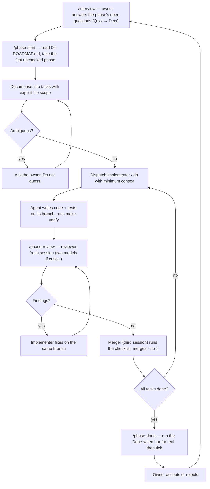

# 08 — AI Workflow

Savdo is built AI-native: the owner writes **zero production code**. Scope, answers,
approvals and acceptance are human. Every line of implementation comes from directed
agents. The process is a deliverable in itself, so it is written down here and measured.

## The fleet

| Role              | Model            | Does                                                                                                                                     | Never does                                                          |
| ----------------- | ---------------- | ---------------------------------------------------------------------------------------------------------------------------------------- | ------------------------------------------------------------------- |
| **Owner** (human) | —                | Sets scope, answers interview questions, approves architecture/dependencies/money, accepts or rejects a closed phase                     | Write code; run the loop by hand                                    |
| **Orchestrator**  | Fable 5.1        | **The interactive session.** Interviews the owner, reasons, decomposes, dispatches with minimum context, sequences, tracks the roadmap    | Write any file — code, tests, docs, decision rows, checkboxes. An orchestrator that edits has stopped orchestrating (D-27) |
| **Implementer**   | Sonnet 5         | Code + tests for exactly one scoped task                                                                                                 | Touch files outside its brief; tick boxes; merge                    |
| **db**            | Sonnet 5         | goose migrations, sqlc queries, seeds; knows the schema traps                                                                            | Edit a merged migration; UPDATE `stock_levels`                      |
| **Reviewer**      | Sonnet 5 / Opus 5 | Reviews a diff against docs, ADRs and the phase bar; findings only. Critical modules: Sonnet **and** Opus, fresh sessions, split scopes | Fix what it finds                                                   |
| **Merger**        | Sonnet 5         | Runs `make verify` and the merge checklist on a branch it did not write; merges `--no-ff`                                                | Merge its own diff; skip the gate                                   |
| **Scribe**        | Haiku 4.5        | Bulk reads, searches, web/version lookups, moves, formatting, changelogs, commit text                                                    | Make a design decision                                              |

Model choice is a cost decision, not a status one. The orchestrator's context is the
scarce resource: forty files of reading go to Haiku, not to Fable.

Definitions live in `.claude/agents/`. There is no orchestrator subagent.

## The loop

## Interviewing the owner

The owner asked to be interviewed rather than guessed at (D-17). Rules:

- Batch questions (up to four per round) with a recommended option first and the
  consequence of each option in one line. Plain English, B1/B2.
- Ask before a phase starts, for that phase's Q-xx entries only. Do not front-load every
  question for every phase.
- Write the answer to `00-DECISIONS.md` as a D-xx **before** dispatching work that
  depends on it. Cross-link to an ADR when it is technical.
- If the owner says "I don't know", record it as still open and design so the choice is
  deferred (adapter, config, feature flag) — see D-09/ADR-009 for the pattern.
- Never re-ask a decided question. Never treat silence as a decision.

## Context discipline

The biggest failure mode in agent-built software is an agent with too much context
making a confident change in the wrong place. The orchestrator's real job is **deciding
what each agent is not allowed to see**.

Every dispatched task carries exactly this:

1. **Goal** — one or two sentences of observable behaviour
2. **File scope** — paths it may create or modify; everything else is out of bounds
3. **Doc pointers** — sections, not paste (`04-DATA-MODEL.md § 3`, `05-API.md § Stock`)
4. **Acceptance check** — the test that must pass, or the behaviour to demonstrate
5. **Known traps** — from § Known failure modes below and `.claude/agents/db.md`
6. **Model and review tier** — ordinary or correctness-critical

An agent that needs context outside its brief **stops and asks**. That is a signal the
decomposition was wrong; the fix belongs in the task.

## Operating constraints (parallel agents)

1. **One writer per worktree.** Parallel implementers use `git worktree` under
   `.claude/worktrees/`; never two writers on one checkout.
2. **Merge early, in dependency order**: contract → migration → service → handler →
   client. Serialize migration-numbering conflicts.
3. **Cap review rounds on ordinary modules**: APPROVE with only MINOR → merge, follow-up
   task for polish. Critical modules need a clean two-model gate.
4. **The orchestrator owns the queue** and the merge order. The merger holds the primary
   checkout until its merges land.
5. **Contract changes serialize.** Only one branch edits `contracts/openapi.yaml` at a
   time; the orchestrator sequences them because every client depends on it.
6. **Shared local services.** One Compose project and one API port serve every worktree — see `07-DEVOPS.md` § Shared local services. Never take the stack down while another agent may be using it.
7. **One heavy gate at a time.** Testcontainers-based gates are sequenced by the orchestrator (O-13); a merger that sees timeouts under load retries once after the machine is quiet, never in parallel.

## Rules (non-negotiable, restated from `AGENTS.md`)

1. No agent merges its own work.
2. Reviewers report; they never fix.
3. The docs are the specification; fix the doc first when it is wrong.
4. Roadmap boxes are ticked only by `/phase-done`.
5. Ask, don't guess.
6. Versions are checked against the registry, never training data.
7. Destructive migrations need explicit owner approval.
8. One task, one branch, one concern.
9. Tests are written by the implementer in the same change.
10. Correctness-critical code (`auth`, `stock`, `sales`, `ai`/`bot` boundary) gets two
    reviewers on different models.

## What only the owner decides

Scope and non-goals · dependencies and version bumps · ADRs · non-additive schema
changes · auth/roles/rate limits/CORS/CSP · money math, ledger and immutability rules ·
LLM provider/model · anything costing money or reaching a real user · closing a phase.

## Known failure modes (grows every phase)

Seeded from experience on the owner's previous AI-native project; Savdo-specific
entries are added by `/phase-done` when a review catches one.

- **Training-data drift.** The stack is at the September 2026 edge (Go 1.2x, TanStack
  Start, Expo latest, Tailwind 4). An agent "fixing" code that is merely newer than it
  is a common finding. Verify with context7 first.
- **Hand-written DTOs.** An implementer declares a response struct because the generated
  one "looked wrong". Fix the spec instead.
- **Filtering secrets in the UI.** Hiding `costPrice` in the admin instead of the
  service. The API is the enforcement point.
- **Quiet scope creep.** "While I was there I also…" — sent back regardless of quality.
- **Ticking boxes.** Any agent other than `/phase-done` editing `06-ROADMAP.md`
  checkboxes.
- **Migration edits.** Editing a merged migration to "fix a typo". Fix forward.
- **Float money.** `float64` for a price in a test helper "just for the fixture".
- **Direct level writes.** `UPDATE stock_levels` in a seed or a test setup. Seeds insert
  movements through the service.
- **Client totals.** Trusting `total` from the request in a sale.
- **Guessing instead of asking.** A reasonable-looking assumption on an open Q-xx.
- **Replacing an official installer on an unverified claim.** T2 swapped golangci-lint's install script for a custom download citing a checksum bug that did not exist (the reviewer ran the script). Verify a bug by reproducing it at the pinned version before working around it.
- **Generated or build output reaching the linter.** `routeTree.gen.ts` and `mobile/dist` both broke `biome ci` after a build. Every generated file gets an explicit Biome exclusion in the same task that introduces it.
- **Prescriptive briefs that are out of date.** The T6 brief told the implementer to add legacy Metro settings; the implementer correctly followed current Expo docs instead. Briefs say "verify against the docs", not "add these keys".
- **Taking the shared stack down.** A parallel task ran `make dev-infra-down` while another was verifying. See operating constraint 6.
- **Trusting proxy headers from the client side.** T4 read the first `X-Forwarded-For` hop and even pinned it in a test; the second reviewer showed it was spoofable. The trusted proxy appends the real client last.
- **Snapshot state in UI shells.** T8 invalidated a query but the layout read a route-context snapshot, so the sidebar kept the old shop name. Shells subscribe to live queries; saves invalidate the router.
- **Parallel heavy gates on one machine.** Two testcontainers suites plus jsdom tests in parallel produced timeouts that looked like failures (O-13). See operating constraint 7: one testcontainers-heavy gate (`make verify`, `go test ./...`) runs at a time; if a merger sees timeouts, retry once after 120 s of quiet.
- **Load-induced gate failures.** Testcontainers container-start deadlines and timeouts cascade when multiple heavy gates run at once. The orchestrator sequences any task needing exclusive use of the dev stack, and mergers never retry a timeout in parallel — wait and retry once after the machine quiets. A 120 s cooldown between gate runs avoids the deadline.
- **Admin vitest pool saturation.** Admin vitest runs with `pool: 'forks'` and `maxWorkers: 2` because unbounded workers crashed under load on the dev machine (T6b).

## Tooling

| File                | Purpose                                                                                 |
| ------------------- | --------------------------------------------------------------------------------------- |
| `AGENTS.md`         | Source of truth for agent behaviour; `CLAUDE.md` delegates to it                        |
| `.claude/agents/`   | `implementer`, `reviewer`, `db`, `merger`, `scribe` with per-role tool restrictions      |
| `.claude/skills/`   | `/interview`, `/adr`, `/phase-start`, `/api-change`, `/phase-review`, `/phase-done`, `/new-module` + 10 vendored general skills (see `VENDORED.md`) |
| `.claude/settings.json` | Permission allow/ask/deny lists so agents run the routine commands without prompts |
| `.mcp.json`         | `context7` (docs), `playwright` (browser verification). No postgres MCP — D-24              |

**context7 is not optional.** Verify API surfaces against it before asserting how a
library works.

## Measuring the process

Tracked honestly in the phase log, including the numbers that look bad:

| Metric                                       | Target            | What a bad number means                                              |
| -------------------------------------------- | ----------------- | -------------------------------------------------------------------- |
| Human-written production lines               | 0                 | The process failed; log where and why                                |
| Review catch rate                            | > 0               | Near zero means the gate is theatre, not that agents are flawless    |
| Rework rate (phases needing a second pass)   | falling           | Measures the **owner's** specs and the orchestrator's decomposition  |
| Escalations per phase                        | non-zero, falling | Zero means agents are guessing                                       |
| Correctness-critical defects reaching `main` | 0                 | The only category with no acceptable rate                            |

**Phase 0 actuals (closed 2026-09-04):** human-written production lines = 0; bootstrap docs were written by the orchestrator under a one-time owner exception, since revoked (D-27) — from then on even doc edits are dispatched. Review catch rate > 0: compaction over the D-22 budget on the orchestrator's own branch; T2's false claim that golangci-lint's install script had a bug, refuted by the reviewer running it; T5's generated route tree breaking Biome; T6's export output reaching Biome; T9's O-08 row describing a setting before it was on `main`. Escalations: Q-14 and Q-15 (tooling: `gh` and Go missing); TypeScript 7 vs 6 per package (O-10); the Metro monorepo config brief being out of date; the shared Compose stack across worktrees (operating constraint 6). Correctness-critical defects reaching `main` = n/a (no such modules exist yet). Rework rate: T2, T5, T6 and T9 each needed one fix round.

**Phase 1 actuals (closed 2026-09-04):** human-written production lines = 0. Review catch rate > 0: T7's guard redirected on any error, not just `401`; T4's client-trusted `X-Forwarded-For` first hop (CRITICAL), a case-sensitive limiter key on a `citext` column, unbounded limiter keys and no request body limit; T8's stale sidebar after a settings save; T9's wrong incident dates; T5's default-location race surfacing as a 500, a blank phone stored non-`NULL`, a first-location-inference bug introduced by the first fix, and an auth password sentence that broke ADR-013's machine-readable-code rule. Escalations: Q-19 (rate-limit abuse horizon) and Q-20 (nullable `PATCH` fields), both still open; D-31 amended mid-phase for `dayjs`; one-heavy-gate-at-a-time (O-13). Correctness-critical defects reaching `main` = 0. Rework rate: T4 needed 2 rounds, T5 needed 3, T7 needed 1, T8 needed 2, T9 needed 1.
